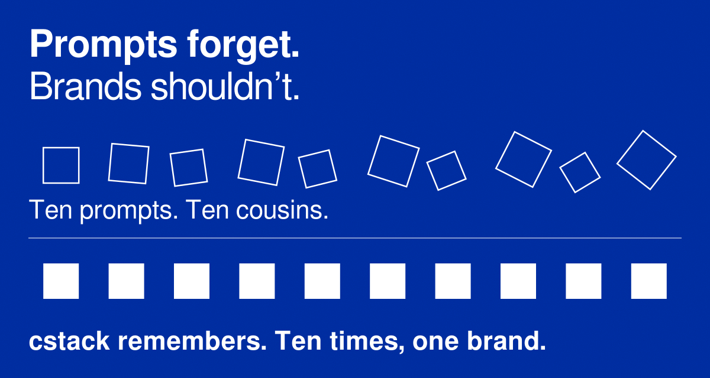
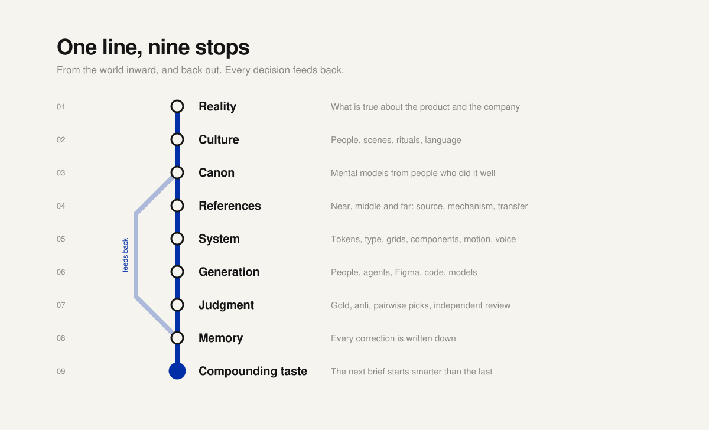

<p align="center">
  
</p>

# cstack

**Great brands are not made once. They are made again, every day, by people who were not in the room.**

The New York subway still reads as one system half a century later. The reason is not a drawing; it is the 1970 standards manual Massimo Vignelli and Bob Noorda wrote at Unimark, so that someone else could make the next sign right. Otl Aicher did the same for Munich in 1972: a grid, a palette and a set of angles that produced every pictogram, poster and ticket. The craft was the system that let the work be repeated.

Generative AI made making cheap. It did not make judgment cheap. Ask a model for your brand a hundred times and you get a hundred cousins: the orange slides toward pink, the type drifts, the product grows a cap it never had, the copy reaches for the word the founder banned last spring. No single image is wrong. The set is.

**cstack is a way to make taste repeatable.** It turns a brand into files an agent can read, check and keep: the decisions and who made them, the references and *why* they work, what was killed and why. Then it gives the agent the habits of a good studio. Brief before making. Find the method before generating. Never let the maker approve its own work. Write down every correction so it is never needed twice.

It is to brand work what [gstack](https://github.com/garrytan/gstack) is to shipping software: thirty specialist skills, a small CLI and plain files in git, so that Claude Code, Codex, Cursor, Gemini CLI or OpenCode works like a disciplined studio instead of a prompt box. Free, MIT, and holding no brand's data: each brand keeps its own workspace in its own repo.

## First, step outside

cstack can keep your taste. It cannot give you any.

Taste comes from distance: the further apart the things you have seen, touched and lived, the more surprising the connections you can make between them. A model is trained on the average of everything, so it will always offer you the nearest idea. The far ones only come from you.

So before you install anything, go outside. Take the long way home. Walk a neighbourhood you do not know. Play a sport badly. Cook something from a country you have never visited. Sit in a building that was made with care and notice how the light arrives. Read outside your field. Have dinner with friends, and with people who do not think like you. Look at something different every day. Every one of those is a reference no search can retrieve.

Then bring it back, and have the courage to use it. Courage is the part no tool supplies: to join two things nobody has joined before, to put it into the world under your name, and to stand by it. Do not play AI like a video game. Do not make more things just because making is now free. Make the thing people did not know they wanted until they saw it.

The machine will repeat your judgment ten thousand times. Make sure it is worth repeating.

**Who this is for**

- **Founders who are also their brand's creative director**, and want the hundredth asset to be as considered as the first.
- **Designers, art directors and writers** who want agents to work to their standard, not around it.
- **Small studios running many brands** without a brand team per client.
- **Anyone who has tried to make AI work look like one brand** and watched it drift.

## Quick start

1. Install cstack (one minute, below).
2. Run `/brief` and describe what you need made.
3. Run `/creative-direction` on the brief it writes.
4. Run `/creative-review` on something you already made.
5. Stop there. You will know if this is for you.

## Install

Requires [Node.js](https://nodejs.org) 20 or newer and Git. Open your agent and paste:

> Install cstack: run **`git clone --depth 1 https://github.com/joaohjonk/cstack.git ~/cstack && cd ~/cstack && ./setup`**, then run `node ~/cstack/bin/cstack.mjs help` and tell me which skills are installed. For brand work, start with /brief.

Or do it yourself:

```bash
git clone --depth 1 https://github.com/joaohjonk/cstack.git ~/cstack
cd ~/cstack && ./setup               # installs the npm dependencies, then links the skills into .agents/skills and .claude/skills
alias cstack="node ~/cstack/bin/cstack.mjs"
cstack help
```

Run `./setup` (or `npm install`) once before the first `cstack` command; on a bare clone the CLI stops and tells you to. `./setup all` also installs for Codex, Cursor, Gemini CLI and OpenCode (`registry/hosts.json`). Setup never installs system software, never asks for keys and makes no paid calls.

**Money and keys.** Provider credentials are read from environment variables by name (`FAL_KEY`, `TASTE_API_KEY`) and never written to disk. A new brand workspace has a budget of zero, so nothing costs money until you say how much it may.

## See it work

An abridged session on **Lumen Field**, a fictional ceramics studio that ships with cstack in [examples/lumen-field](examples/lumen-field). Everything the agent refers to below is a real file in that folder.

```text
You:    We need three autumn photos for the ochre plates.
You:    /brief
Claude: Before anything is made: where do these live, and what must
        "autumn" never mean here?
        [reads the brand: 22 sourced facts, 3 unknown, 1 in conflict]
        I'm going to question "three photos". The page needs one hero
        and one honest grid of the batch. And the hero is not autumn;
        it is the moment after breakfast, a plate that has been used.
        [writes the brief: objective, gold standard, musts, must-nots]

You:    (strike "a curated batch to elevate your table". We don't talk like that.)

You:    /creative-direction
Claude: [three territories, never averaged; one recommended;
         rejected: showroom marble and steam, black velvet and gilt]

You:    /shot-dna
Claude: 50-65 mm at seated eye level, 30-40 degrees down. North window
        from frame left, late afternoon, no fill. A cutlery scuff on the
        glaze and crumbs off the edge, on purpose.

You:    /workflow product-photoshoot
Claude: The plate itself will be photographed and composited, never
        generated: its glaze is a locked fact.
        Kiln Ochre is in conflict. The palette spec says #B8742A, the
        swing-tag spec says #C98A3E. I will not average them. Which is right?
        The budget is 0. Two probes would cost $0.08. Raise it, or I
        stay on the free mock provider.

You:    /creative-review
Claude: [strategist, art director, photographer and editor review
         separately from the maker; their disagreement about the crop
         stays visible; you decide]

You:    /learn-loop retro
Claude: You struck "curated" and "elevate". The interview says "never say
        artisanal". Promote these to banned language for every future brief?
```

You asked for three photos. The agent noticed you needed one hero and one proof, refused to guess a colour the brand had not settled, kept the real product real, and asked before spending a cent. That is not a prompt box. That is a studio that remembers.

## The studio

cstack is a process, not a pile of prompts. The skills run in the order good brand work runs:

**Think → Know the brand → Look outward → Direct → Make → Judge → Remember**

Each one writes files the next one reads. `/brief` writes the brief that `/creative-direction` answers. `/shot-dna` writes the camera and light that `/prompt-director` compiles. `/creative-review` reads the brief, not the maker's opinion of its own work.

| Skill | Your specialist | What they do |
|---|---|---|
| `/brief` | **Creative strategist** | Start here. Interrogates the ask, reframes it, writes the gold-standard version an exceptional team would make with time, then a short brief every other skill reads. |
| `/creative-direction` | **Creative director** | Three distinct territories for identity, words and image. Diverge, critique, mutate; never average. One recommendation, a rationale and a rejection list. |
| `/flow-research` | **Head of production** | Before anything new is made, researches how that outcome is best made today: tools, models, what practitioners actually post. Compares at least two methods and writes the plan with a gate on every step. |
| `/brand-import` | **Brand archivist** | Turns an existing brand (assets, site, decks, repos, Figma) into sourced facts, tokens, entities and seed gold and anti libraries. Says UNKNOWN instead of guessing. |
| `/identity-system` | **Design systems lead** | Turns a chosen direction into tokens, type hierarchy, grids, logo rules and component contracts, each decision at the lowest level that holds it reliably. |
| `/type-director` | **Type director** | Chooses, pairs and systematizes type for the job (languages, voice, licence, performance) and checks it on the rendered page: measure, leading, contrast, fallbacks. |
| `/taste-search` | **Researcher** | References as a graph, not a moodboard: near, middle and far, each with its source, the mechanism that makes it work, and how it transfers. |
| `/cultural-scan` | **Cultural strategist** | Reads live scenes, rituals, language and objects, and scores a brand's cultural assets: can people decode it, repeat it, carry it? |
| `/competitor-intel` | **Category analyst** | A dated corpus of the category: its conventions, its white space, the claims everyone already makes. |
| `/site-capture` | **Studio assistant with a browser** | Responsive screenshots, PDFs, accessibility snapshots and computed styles from live pages, with an origin lock. Ported from gstack. |
| `/shot-dna` | **Photographer** | Breaks a reference or a planned shot into camera, lens, height, a named lighting recipe, surfaces and deliberate imperfections. Lighting as a recipe, never an adjective. |
| `/campaign-sequence` | **Art director** | Plans a campaign as a sequence of roles (icon, world, ritual, product, proof, closer) and judges the set, not the single frame. |
| `/product-fidelity` | **Product lead** | Locks the real product (silhouette, label, closure, colour) and picks a method that keeps it true. Checks every output for drift. |
| `/video-direction` | **Film director** | Beat sheets for product heroes, brand films, cut-downs and logo stings, with one world, a production path per beat and disclosure gates. |
| `/symbol-design` | **Identity designer** | Logo, symbol and monogram exploration the way a studio does it: wide and cheap, judged in one colour at 32 px, then construction and optical correction. |
| `/vector-master` | **Production artist** | Clean SVG masters, linted structure, reduction tests, one-colour versions, lockups, favicon and app-icon kits. |
| `/copywriting` | **Copywriter** | Writes in a declared mode (conversion, campaign, editorial, product truth) in the brand's voice and vocabulary; banned words stay banned. A separate pass checks it. |
| `/prompt-director` | **Prompt engineer** | Compiles decisions into versioned recipes with named slots and seeded variants, so a good result can be made again and a change can be diffed. |
| `/model-router` | **Technical director** | Picks the model for the job from a dated registry, runs a small probe when unsure, never trusts a stale price. |
| `/generate-media` | **Producer** | Guarded generation: dry run and estimate first, cheap probes before finals, never pays twice, re-attaches to pending jobs. |
| `/image-edit` | **Retoucher** | Repairs one region and keeps every good decision; composites official logos and labels instead of letting a model redraw them. |
| `/mockup` | **Packaging and print artist** | Places approved art on packs, cans, apparel, signage and screens, then proves pixel by pixel that the art survived. |
| `/three-d` | **3D artist** | Web heroes that rotate on scroll, packshots, turntables, AR views, built from the real product with the official label as texture, checked against a size budget. |
| `/video-assembly` | **Editor** | Cuts, reframes per channel, burns captions inside safe zones, normalizes loudness and checks frames for drift. No model spend. |
| `/creative-review` | **The crit** | Independent lenses (strategist, art director, photographer, type, editor, culture, commerce, compliance), run apart from the maker. Disagreement is kept, not averaged. |
| `/brand-verify` | **Brand guardian** | Deterministic gates first (tokens, raw colours, type, clear space, aspect, banned words), then a verifier, then you. |
| `/claims-proof` | **Claims editor** | Every claim tied to its proof and to current primary regulation, with uncertainty marked. |
| `/learn-loop` | **Studio memory** | Observe, compare, articulate, decide, encode. Corrections and picks become rules only when the evidence repeats. |
| `/creative-autoresearch` | **R&D** | A bounded keep-or-discard experiment on one variable against a frozen test, with a budget and a stop. |
| `/workflow` | **Producer of record** | Runs a whole job (brand, campaign, photoshoot, landing page, packaging, deck, 3D, video, logo) as a resumable plan with owner gates. |

Each skill has a fixed contract (inputs, what to do when an input is missing, precedence, process, outputs, evals, handoff, failure modes) and a context budget that CI enforces.

## How it thinks

<p align="center">
  
</p>

Six rules hold the whole thing together:

- **A brand is a living entity, not a PDF.** Every fact carries its source, its status (LOCKED, CURRENT, TESTING, PROVISIONAL, UNKNOWN, CONFLICT, KILLED and a few more) and who approved it. A model guess can never overwrite an owner's instruction. Conflicts are surfaced, never averaged.
- **Collect models, not looks.** A reference is stored as source, mechanism and transfer. If you can remove the image and still explain why it works, it is a mechanism; otherwise it is a costume.
- **Method before making.** Nothing is one-shot. Before an outcome is attempted, the agent names the target, looks up how it is best made today, compares at least two ways and works step by step against it. `cstack flows check` refuses a plan that skipped any of that.
- **Deterministic before generative, cheap before premium.** Tokens, lints, crops and measurements before models; probes before finals; a budget and a stop condition before any batch.
- **The maker never certifies its own work.** Beautiful, on-brand, culturally alive, effective and correct are separate judgments made by separate reviewers.
- **The owner's taste is sovereign.** Picks, kills and edits are recorded as preference data; repeated evidence becomes a rule. Don't forget this. Judgement and taste are the most important skill in the age of abundance.

The long version is in [docs/philosophy.md](docs/philosophy.md) and [docs/architecture-one-page.md](docs/architecture-one-page.md).

## First ten minutes

```bash
cstack brand init ~/brands/acme --name "Acme"    # a brand workspace, its own git repo
cd ~/brands/acme
cstack brand check                               # what is known, unknown and in conflict
cstack tools --mcp "Figma,Refero"                # which research tools you actually have
cstack providers                                 # which media providers are usable here
```

Then, in your agent:

```text
/brief                  reframe the ask, write the brief
/brand-import           an existing brand   (or: /workflow create-brand for a new one)
/creative-direction     three territories, one recommendation, a rejection list
/workflow <name>        campaign, product-photoshoot, landing-page, paid-social, packaging, deck ...
/creative-review        independent lenses, disagreement kept visible
/brand-verify           deterministic gates, then a verifier, fix, re-verify, then you
/learn-loop retro       promote only what has earned it
```

A step-by-step walkthrough with no spend is in [docs/quickstart.md](docs/quickstart.md).

## Workflows

`/workflow <name>` runs a whole job as a resumable plan with owner gates and a tracker in `work/plans/`:

`create-brand` · `import-brand` · `campaign` · `product-photoshoot` · `paid-social` · `landing-page` · `packaging` · `deck` · `product-3d` · `product-video` · `logo-system`

Every step names its skill, inputs, outputs, gate, and what to do when a tool or provider is missing. Definitions live in [workflows/](workflows).

## The CLI

The agent does the judging. The CLI does everything that should never depend on a model's mood.

```bash
cstack search "product photoshoot"                         # find the right skill
cstack flows search "rotating 3d product on the homepage"  # the researched method, before making
cstack flows check work/flows/*.flow.yaml                  # two options compared, a gate on every step, a stop
cstack brand context --sections voice,color                # compact, cache-stable facts for a prompt
cstack taste search "a ritual that feels choreographed"    # Taste Labs, when TASTE_API_KEY is set
cstack route --modality image --needs image-edit,text-rendering
cstack prompt compile recipes/hero.recipe.yaml --seed 7
cstack spend plan batch.json --stop "2 of 4 probes fail fidelity"
cstack generate --file request.json --dry-run
cstack browse qa http://localhost:4173                     # overflow, alt text, contrast at 375/768/1440
cstack tokens check && cstack tokens build
cstack type qa http://localhost:4173                       # measure, leading, caps, contrast, fallbacks
cstack svg reduce mark.svg                                 # does the mark survive at 16 px?
cstack mockup verify --template t/can --art label.svg --render can.png
cstack 3d inspect model.glb --budget web-hero              # bytes, triangles, textures, scale, origin
cstack video qa master.mp4 --product-ref still.png --roi 380,600,320,420
cstack learn candidates                                    # what has earned promotion to a rule
cstack health                                              # skill validity, budgets, staleness
```

`cstack help` lists every command. Video checks need `ffmpeg` on your machine; browser checks need a Chromium and the optional `playwright-core`. cstack never installs either.

## Research tools and providers

cstack knows the tools good studios already pay for and checks which ones you have (`cstack tools`): Taste Labs, Cosmos, Refero, Mobbin, Ecomm.Design, Baymard, Particl, BuiltWith, Store Leads, Helium 10, SmartScout, Nexscope, Foreplay, Shortimize, Really Good Emails, and Figma's and Shopify's MCPs. For making, it knows 3D (Blender, Spline, Needle, Meshy, Tripo, glTF Transform), mockups and vector (Dynamic Mockups, Recraft, Adobe, Canva, Pacdora), video (fal, Higgsfield, HeyGen, Replicate, Runway) and type (Google Fonts, Adobe Fonts, foundry trials, Fonts In Use, fontTools).

None is required; every one has a fallback. Tools whose terms bar automated agents are used only through your own exports or by you. Media generation runs through one guarded call with dedupe, budgets and pending-job recovery: fal and a free mock provider are live, Taste Labs is implemented against its documented API, the rest are stubs. Details: [docs/integrations.md](docs/integrations.md).

## Make it yours

- **Add a brand.** `cstack brand init <dir> --name "Brand"`, then `/brand-import` or `/workflow create-brand`. Official assets go in `assets/official/` and are never overwritten. The workspace is the brand's own repo; nothing in it flows back into cstack.
- **Add a provider.** Write an adapter in `providers/` against `providers/index.mjs`, read keys from env vars only, register it in `registry/providers.json`, and add its models to `registry/models.json` with a dated source and price.
- **Write a skill.** Copy one, keep the contract headings, fill `skill.meta.json`, add a fixture in `evals/fixtures/`, then `cstack index && cstack validate && cstack budget --check`. See [docs/skill-authoring.md](docs/skill-authoring.md).
- **Teach it.** Corrections, pairwise picks, failures and provider quirks go to the workspace's `state/*.jsonl`. `cstack learn promote` moves repeated evidence into a durable home with its provenance. Brand lessons stay in the brand's repo; only general mechanisms come back to cstack. See [docs/learnings.md](docs/learnings.md).

## Where it stands

v0.1, beta. The skills, workflows, flows, checkers and schemas exist and pass their static checks and tests. What has not happened yet is said plainly in [docs/retro.md](docs/retro.md): no model-backed eval runner, no real brand run (that happens in each brand's private repo), checker thresholds not yet calibrated against an owner's verdicts. Workflows stay `template` and flows stay `researched` until a real run proves them. The next steps are in [docs/backlog-v0.2.md](docs/backlog-v0.2.md).

## Acknowledgements

cstack is open source, but its point of view did not appear from nowhere.

It is built from years of looking, making, collecting, arguing, building brands, breaking things, and learning from people whose work changed the way I see. Some are canonical. Some run small studios. Some make buildings, books, clothes, photographs or films. Some happen to ride bikes, surf, ski or play football beautifully.

**Thank you, personally,** to Danil; to Stefano, my partner; to Fred Peclat of Atelier Peclat; to Airon Martin of Misci; and to all the marketers, brand builders and growth people I have worked with over the years. Some of this started in conversations with you.

A word on the names. I mention them because at some point I consumed, saw, or only briefly saw some of their work, and I think it changed me a little. This is a list of debts of attention, not of sources: nothing here is copied, and most of these people have no idea cstack exists.

Among them:

**In Brazil.** Atelier Peclat and Fred Peclat, Lígia Casas, PORTO ROCHA and Felipe Rocha and Leo Porto, REBU and Fernando Andreazi and Pedro Mattos, HardCuore and Breno Pineschi and Rafael Cazes, Louise Winkler Freshel / ouieieee, Polar and Lais Ikoma, Ronaldo Vidal, Ralph Mayer, and Sweety & Co.

**In graphic design and creative practice.** Massimo Vignelli, Mirko Borsche / Bureau Borsche, OK-RM (Oliver Knight and Rory McGrath), Experimental Jetset, Irma Boom, PLAYLAB, INC. (Archie Lee Coates IV and Jeff Franklin), COLLINS and Koto.

**In architecture, objects and space.** Peter Zumthor, Pierre Yovanovitch, Carlo Scarpa, David Chipperfield, John Pawson, Tadao Ando, Isay Weinfeld, Álvaro Siza, Eduardo Souto de Moura, Aires Mateus, Bijoy Jain / Studio Mumbai, Anne Holtrop, Formafantasma, Faye Toogood, Michael Anastassiades, Charlotte Perriand and Isamu Noguchi.

**In fashion and worldbuilding.** Jonathan Anderson, Miuccia Prada, AMO and Rem Koolhaas, Rei Kawakubo, Martin Margiela, Virgil Abloh, Grace Wales Bonner, Simon Porte Jacquemus and George Heaton.

**In art and image-making.** Josef Albers, Mark Rothko, Constantin Brancusi, Donald Judd, Wolfgang Tillmans, Olafur Eliasson, James Turrell, David Hockney, Pierre Huyghe, Coco Capitán, Klaus Kremmerz, María Jesús Contreras and Annie Choi.

**In moving image.** Paul Thomas Anderson, Jonathan Glazer, David Lynch, Andrea Arnold, Roy Andersson, Apichatpong Weerasethakul, Martin Scorsese and Gaspar Noé.

**In culture, products and systems.** Ana Andjelic, Hans Ulrich Obrist, Jony Ive, Dieter Rams, Walt Disney, Herb Ryman and the generations of Imagineers, and Andrej Karpathy.

**At the table.** Some of the biggest jumps in thinking came from outside design entirely. A meal at TUJU or at El Celler de Can Roca changes what you believe an experience can be. Winemakers like Charles Lachaux at Domaine Arnoux-Lachaux and Stella di Campalto take craft and care to a level that is almost devotional. This is an ode to them: unrelated to brand work, and impossible to forget.

**At home.** Chico da Silva, Bertô, Carlos Motta, Paulo Monteiro da Silva, Rochegaussen and Fred Peclat made a few things I have the privilege to look at every day.

**In motion.** And people whose medium is not normally filed under design: Candide Thovex, Craig Anderson, Rob Machado, Mikey February, Tadej Pogačar, Roger Federer, Carlos Alcaraz, Ronaldinho and Mat Fraser. They are reminders that taste can live in a line, a decision, an economy of movement, an unexpected attack, or thousands of repetitions that eventually look effortless.

These people did not build cstack, and their inclusion implies no affiliation or endorsement. Their public work simply helped build the taste, the questions and the ways of working behind it. The goal of cstack is not to imitate any of them. It is to make the things they taught me easier to remember, and harder to reduce to a prompt.

For the longer notes on what the method learned from each, with links to the [canon](canon/), see [docs/lineage.md](docs/lineage.md). If I have described your work wrongly, or you would rather not be named, open an issue and I will change it.

## Docs

[Architecture on one page](docs/architecture-one-page.md) · [Architecture](docs/architecture.md) · [Philosophy](docs/philosophy.md) · [Quickstart](docs/quickstart.md) · [Provenance](docs/provenance.md) · [Cost and context](docs/cost-and-context.md) · [Evals](docs/evals.md) · [Learnings](docs/learnings.md) · [Skill authoring](docs/skill-authoring.md) · [Research notes](docs/research/) · [Retro](docs/retro.md) · [v0.2 backlog](docs/backlog-v0.2.md)

## License

MIT. Parts of the browser layer derive from [gstack](https://github.com/garrytan/gstack) (MIT, Copyright (c) 2026 Garry Tan); see [NOTICE.md](NOTICE.md).
