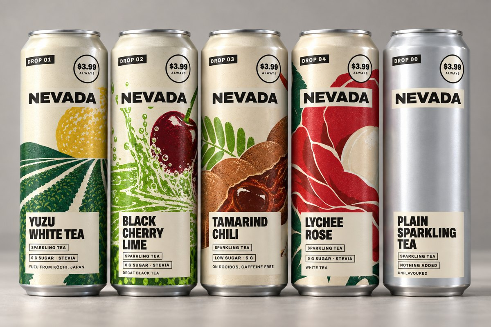
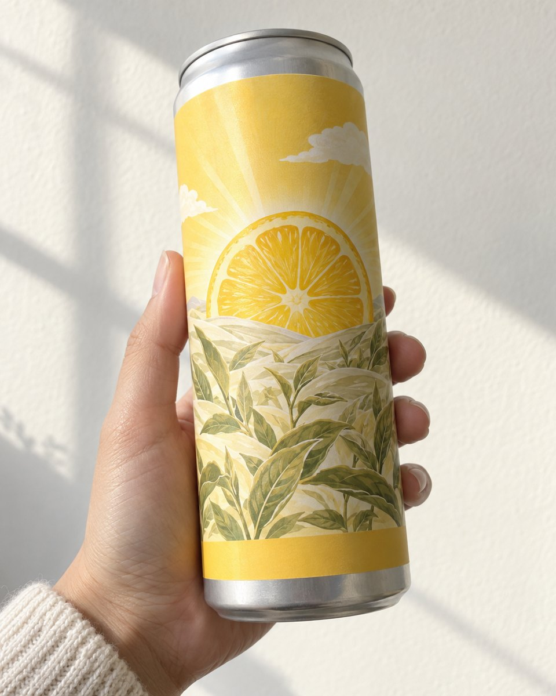
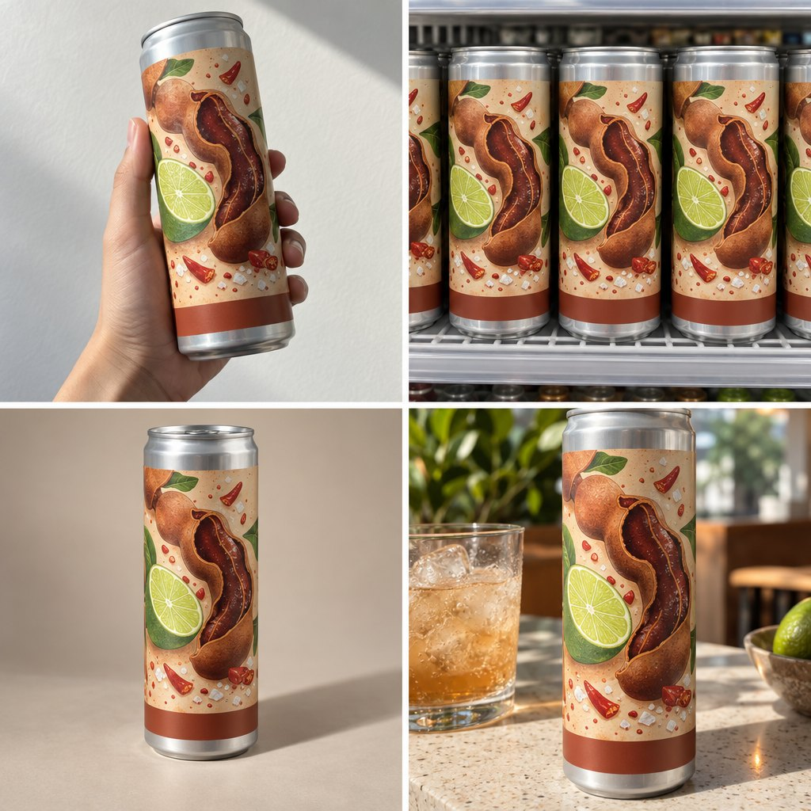
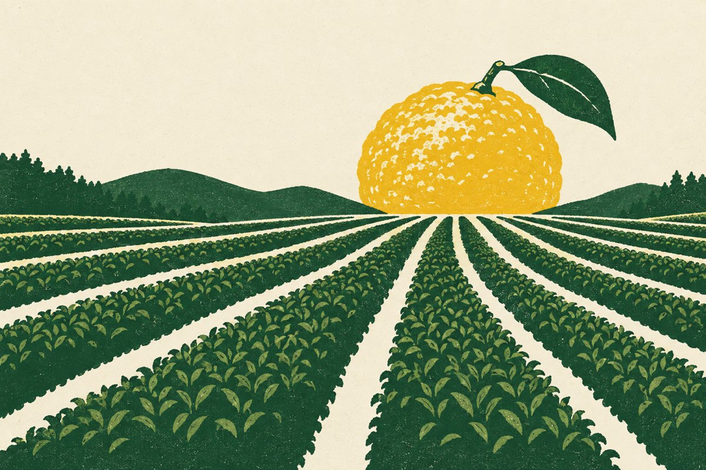
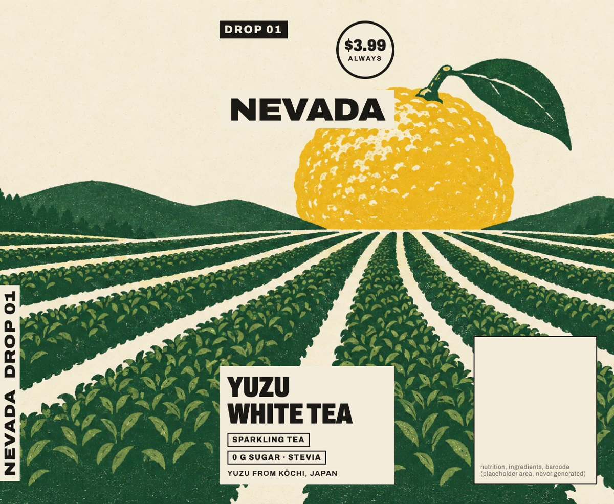
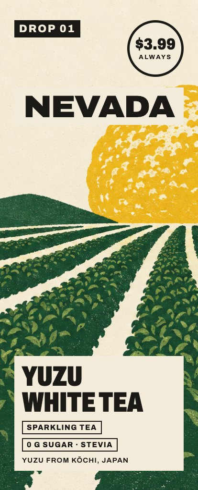
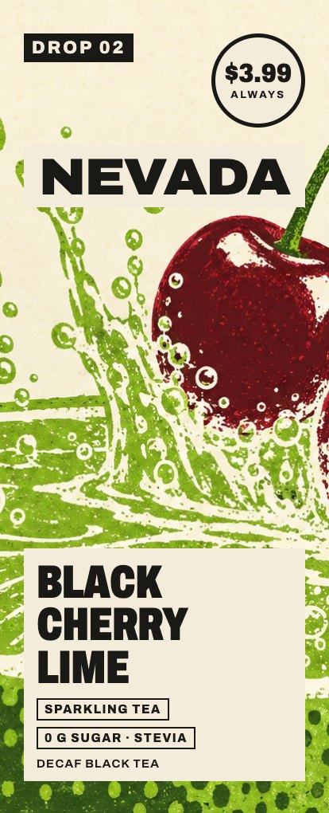
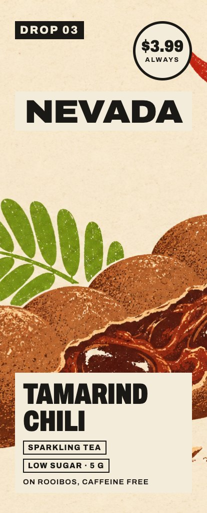
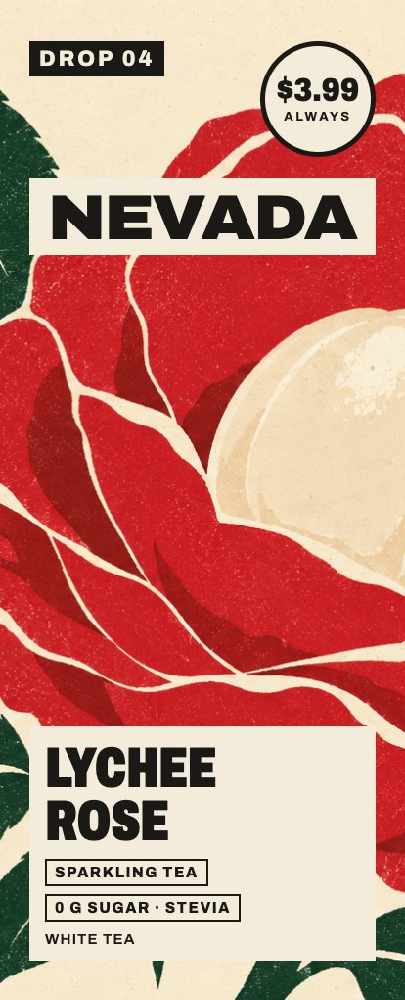
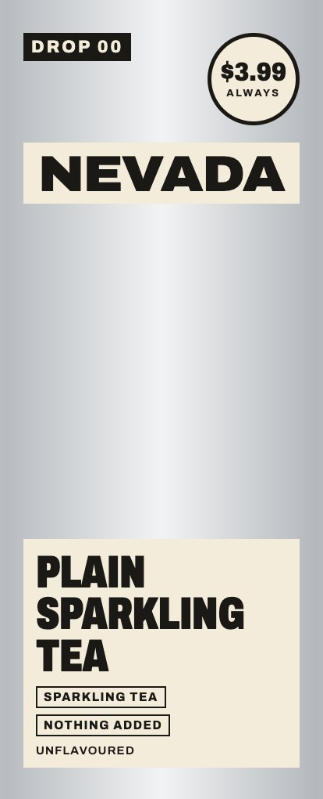

# Nevada: a brand from zero, made with cstack

Nevada is a fictional sparkling iced tea, built from zero with cstack in one day (2026-10-05) as a field test. The founder was played by cstack's owner, and every step below is a real cstack step with the owner's real verdicts. Nevada is not a product, and no one sells it.

<p align="center">
  
</p>

## 1. The founder first

cstack would not make a single image until it had interviewed the founder. `/brief` in founding mode ran three rounds of questions: why the brand exists, who drinks it, the brand as a person, and what it will never be. The answers went into a founder brief that waited for the founder's yes (`cstack brief approve --by`).

- **Why:** iced tea is loved and too sweet. Nevada is the daily can without the sugar.
- **Market:** the founder's anchor was "a better, healthier version" of the famous tall-can iced tea. It is a mass hype brand priced premium for premium ingredients, launching on TikTok Shop and then in premium and mass grocery.
- **Customer:** Gen Z, and healthy millennials nostalgic for cold tea.
- **Range:** four sparkling flavours (yuzu white tea, black cherry lime, tamarind chili rooibos, lychee rose), zero or low sugar, plus a plain can.
- **Never:** a protein brand.

The founder changed course halfway, from a quiet colour-field can to a loud mass brand. cstack logged the change with `brief reopen --reason`, and making stayed locked until the founder approved the new brief.

## 2. References, then territories

The founder reacted to a references board (keep or kill, with a reason) before any territory was written. cstack then offered three territories, never averaged:

- **A, The Tall Poster:** one big picture per flavour round a tall can.
- **B, Loud and Good:** maximal colour for Gen Z.
- **C, The Drop:** each flavour launched as a numbered limited drop.

The founder picked **A, with C's numbered drops**, and cstack wrote that up as territory D, "The Tall Poster Drop". The plain can is bare metal, and an honest price is printed on every can.

## 3. Explore: "kinda ok"

The first round was 22 images on the current leading image model, shown on a blind contact sheet (`cstack sheet make --blind`). The rule against text in generated images kept the model from inventing lettering, but it also stripped the pack of its system. The founder's verdict: "kinda ok", then "just ugly craft on the packaging".

<p align="center">
  
  
</p>

## 4. Craft first: "kinda enjoy"

The fix was to stop asking an image model to design a pack. The five wraps were designed flat, with real type: the wordmark, the drop number, a round price badge, and the flavour, sugar and origin lines. Only the poster picture is generated, in a flat three-ink screen-print style: yuzu as the sun over tea rows, cherries cannonballing into a lime pool, a tamarind pod lit like a firecracker, a lychee pearl in a rose, and bare metal for the plain can.

<p align="center">
  
  
</p>

<p align="center">
  
  
  
  
  
</p>

## 5. Polish: "all real cool"

The flat wraps went onto tall cans with an image edit model, and an independent check then compared every letter on the cans against the flat files. It caught one: an origin line drawn with the wrong accent on two early renders, which the final lineup fixes. The cans also come out a little too tall, so these renders are illustrative; the exact next step is to put the flat wraps on a true 3D can.

The name came last. The founder asked for a state name that recalls the anchor brand, and **Nevada** reads as "never": *Never too sweet.*

## What it cost

About USD 2.32 of generated images for this direction, on estimates booked in the workspace ledger before each call. Price, sugar and origin numbers on the cans are placeholders.

## What cstack got wrong

The run's real output was dozens of mistakes in cstack itself, each logged as a numbered finding and fixed or queued. A few:

- cstack treated "just go" as a waiver of the founder interview. It now refuses to make anything before an approved founder brief.
- It defaulted to a familiar image model instead of the current leader. Routing now ranks models by a dated leaderboard.
- It let an image model design the pack, with no flat-artwork stage.
- Its text check failed renders whose type was correct.
- It had no naming method: the name was found by hand.

## The commands

```text
/brief                                  founding interview, three rounds
cstack brief approve <brief> --by <founder>
cstack brief reopen <brief> --reason "..."
cstack flows gate --stage make          refuses until brief and reactions exist
cstack route --job image                the best model now, with its date
cstack sheet make --blind               contact sheet, picked before any review
cstack sheet import picks.json          picks become feedback
/creative-review                        reviewers kept apart from the maker
cstack spend summary                    estimated against billed
```

The images on this page were generated for this field test by cstack's owner with GPT Image 2.5 (via fal), from cstack's own prompts and flat artwork. No reference image or third-party picture appears on this page.
