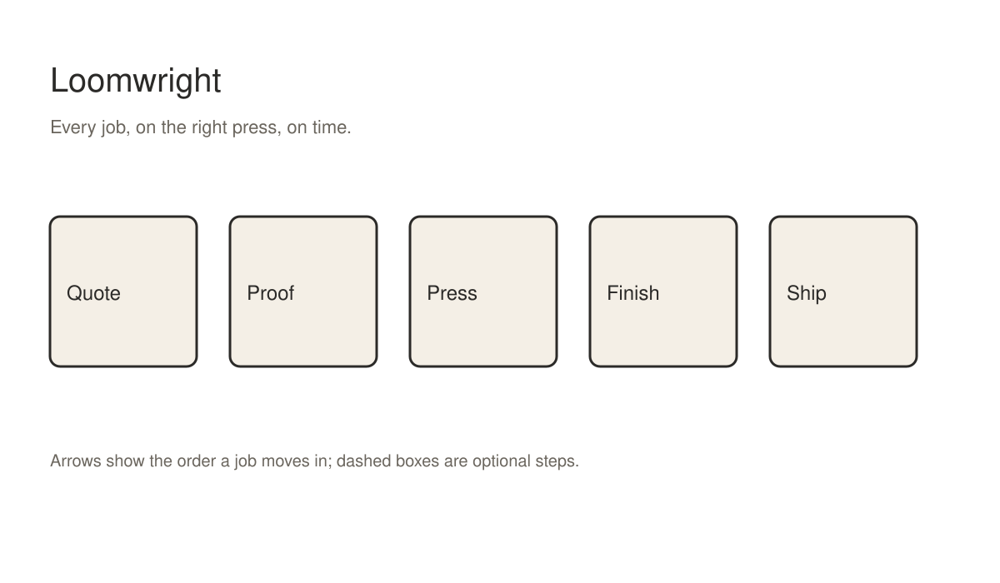
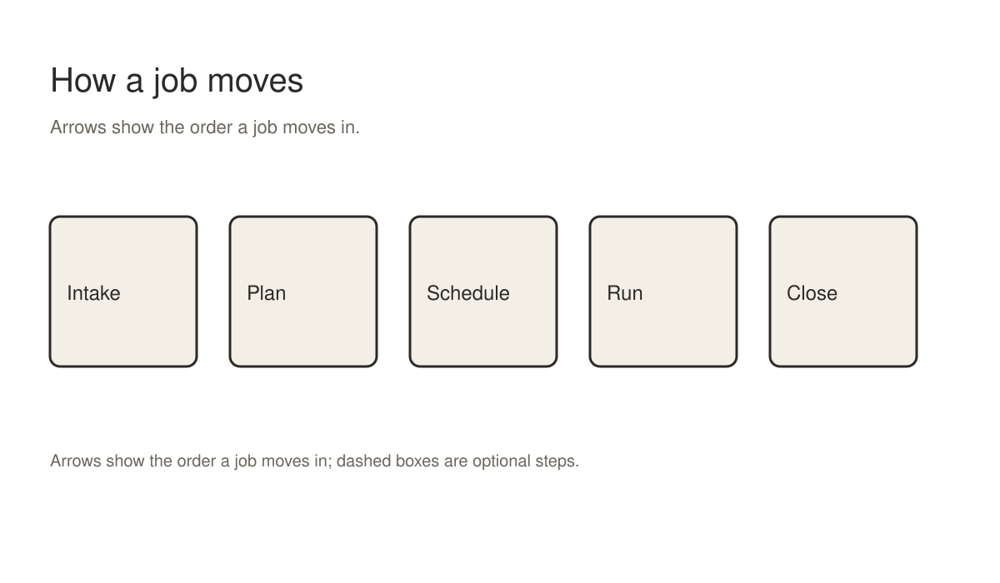
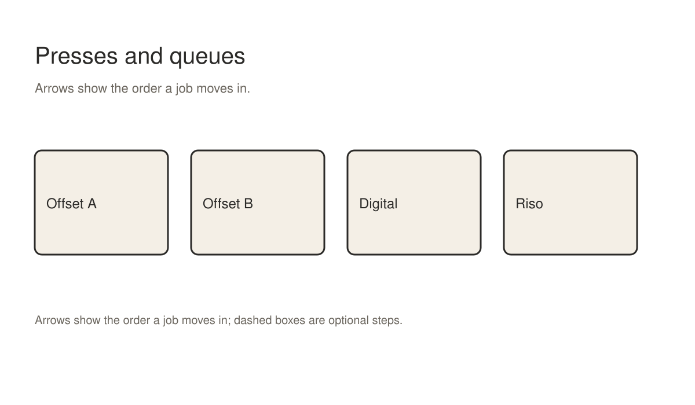

<p align="center"></p>

# Loomwright

**Every job, on the right press, on time.**

Loomwright is an open-source job scheduler for small print studios. It reads the jobs you already quote, the presses you already own and the hours your people already work, and it tells you which job goes on which press, in which order, so the promised date holds. It runs on one laptop in the studio. It needs no server, no account and no subscription, and it never sends your customer list anywhere.

Most small studios schedule on a whiteboard, in a spreadsheet or in the head of the one person who has been there longest. That works until it does not: a rush job arrives, a press goes down for a day, a paper delivery slips, and suddenly three promises collide on a Thursday afternoon. Loomwright exists for that Thursday. It keeps the plan in one place, shows the collision before it happens, and suggests the cheapest way out of it.

<p align="center"></p>

## What it does

Loomwright keeps three lists: jobs, presses and people. A job has a quantity, a stock, a set of inks or a print profile, a finishing route and a promised date. A press has the stocks and sizes it accepts, a speed, set-up and wash-up times, and the hours it is available. A person has the skills they hold and the hours they work. From those three lists Loomwright builds a schedule that meets every promised date it can, and it tells you plainly which dates it cannot meet and why.

When something changes, you change the list, not the schedule. A press goes down: mark it unavailable for the day and Loomwright moves its jobs to the next best press, or tells you which promise breaks. A rush job arrives: add it with its date, and Loomwright shows you what it would push and by how much, before you say yes to the customer.

The schedule is a plain file in your studio folder. You can print it, pin it on the wall next to the old board, or open it on the tablet by the press. Loomwright never hides a decision inside a database: every move it makes is a line in a log you can read.

## Every job, on the right press, on time.

That sentence is the whole promise, and every part of it matters. Every job means rush jobs and reprints too, not only the jobs that fit neatly. The right press means the one that can print it well and cheaply, not the first one that is free. On time means the date you told the customer, with the finishing and the courier included, not the date the sheets come off the press.

Loomwright checks all three on every change. When it cannot keep all three, it keeps the date first, then the quality, then the cost, unless you tell it otherwise for that job. The order is a setting, because some studios would rather lose a day than run a fine-art print on the fast digital press.

<p align="center"></p>

## Quick start

Install Node 20 or newer, then:

```bash
npm install -g loomwright
loomwright init my-studio
cd my-studio
loomwright add press "Offset A" --sheet SRA2 --speed 6000
loomwright add job "Spring catalogue" --qty 2000 --due 2026-11-02
loomwright plan
```

`loomwright plan` prints the schedule and writes it to `schedule.md`. Open that file next to the board and compare. The first plan is only as good as the lists behind it, so expect to correct a few press speeds and set-up times in the first week.

## Why we built it

We ran a four-person risograph and offset studio for six years. Our scheduling tool was a magnetic board with coloured cards, and it was good: anyone could read it from across the room, and moving a card was a decision everyone saw. What the board could not do was arithmetic. It did not know that the second offset press needs forty minutes of wash-up between a metallic ink and a pale one, that the guillotine is shared with the bindery on Tuesdays, or that our best finisher works four days a week. We did that arithmetic in our heads, and we got it wrong about once a month.

Commercial print management systems do that arithmetic, but they are built for plants with forty presses and a planning department. They cost more per year than our largest press, they want a server in a cupboard, and they take months to set up. We wanted the magnetic board with a calculator behind it: something a studio could install on a Friday and trust on a Monday.

So we wrote Loomwright, first for ourselves, then for two neighbouring studios who kept asking to borrow it. It is now used by a few dozen studios we know of, from a two-person letterpress shop to a twelve-person digital and offset studio that prints for three universities. Every feature in it exists because one of those studios needed it on a real job.

## Who it is for

Loomwright is for studios with between one and about fifteen presses and between one and about thirty people. Below that, a notebook is enough. Above that, you probably need a planning department and the software that comes with one. In between there are thousands of studios scheduling by memory, and Loomwright is for them.

It suits offset, digital, risograph, letterpress and screen printing, and any mix of them. It does not care what your presses are, only what they can do and how long they take. It also handles the work around the press: plate making, proofing, guillotine, folding, binding, packing and courier collection, each as a step with its own time and its own person.

## Install

Loomwright is a single command-line program with no native dependencies. It runs on macOS, Windows and Linux wherever Node 20 runs. A studio usually installs it on the one computer that already holds the job folder, so the schedule lives next to the files it describes.

If you prefer not to install anything globally, `npx loomwright` runs it from the package registry each time. Studios that keep everything in a shared folder can also check the program into that folder and run it from there.

## The three lists

### Jobs

Each entry in the jobs list holds:

- name
- customer reference (never the customer name, unless you add it)
- quantity
- stock and size
- inks or print profile
- finishing route
- promised date
- priority

You can edit the jobs list by hand: it is a plain YAML file, one entry per block, and Loomwright tells you exactly which line it could not read. Comments are kept when Loomwright rewrites the file, so your notes about a fussy press survive every plan.

### Presses

Each entry in the presses list holds:

- name
- process
- sheet sizes
- stocks it refuses
- speed per hour
- set-up minutes
- wash-up minutes between ink families
- hours available per day

You can edit the presses list by hand: it is a plain YAML file, one entry per block, and Loomwright tells you exactly which line it could not read. Comments are kept when Loomwright rewrites the file, so your notes about a fussy press survive every plan.

### People

Each entry in the people list holds:

- name or initials
- skills
- hours per day
- days off
- which presses they may run alone

You can edit the people list by hand: it is a plain YAML file, one entry per block, and Loomwright tells you exactly which line it could not read. Comments are kept when Loomwright rewrites the file, so your notes about a fussy press survive every plan.

## Rules we keep

1. Every job, on the right press, on time.
2. A schedule is a proposal until a person accepts it.
3. Every move is logged in words a press operator can read.
4. No customer data leaves the studio computer.
5. A broken promise is shown the moment it becomes likely, not on the day.
6. The lists are plain files; you can always leave and take them with you.

These rules decide arguments about features. A feature that needs a server breaks rule four, so we do not build it, even when it would be convenient. A feature that moves jobs without telling anyone breaks rules two and three, so the automatic re-plan always waits for a person to accept it.

## See it work

The repository ships an example studio, `examples/harbour-press`, with four presses, nine people and sixty jobs taken from an anonymised month at a real studio. Run `loomwright plan` inside it to see a full schedule, then run `loomwright what-if --down "Offset B" --on 2026-11-04` to see what happens when a press fails on a busy Wednesday.

The what-if report lists every job that moves, where it moves to, and which promises break. In the example, losing the second offset press for a day breaks one promise out of sixty, and Loomwright suggests running that job on the digital press with a note that the metallic ink will be simulated. The studio decides whether that is acceptable for the customer; Loomwright only shows the choice.

A second example, `examples/two-desk-letterpress`, shows the other end of the range: one press, two people, and long make-ready times. There the interesting decisions are about batching jobs that share an ink, and the report shows how much make-ready time each batch saves.

## How planning works

Planning happens in three passes. The first pass places jobs with fixed dates and fixed presses, the ones that leave no choice. The second pass places the remaining jobs in date order, choosing for each the press that keeps its date at the lowest cost, counting set-up and wash-up against what is already on that press that day. The third pass looks for swaps that save wash-ups or overtime without breaking any promise.

Cost here is not money unless you give Loomwright prices. By default it counts minutes: printing minutes, set-up minutes, wash-up minutes and overtime minutes, with overtime weighted double. Studios that track costs can give each press an hourly rate and each person an overtime rate, and then the plan minimises money instead.

The planner is deterministic. The same lists produce the same schedule on any computer, which matters when two people compare plans. Randomness only enters if you ask for alternative plans with `loomwright plan --alternatives 3`, and even then each alternative is reproducible from its seed.

Planning a month of jobs for a ten-press studio takes about a second on an ordinary laptop. Planning a quarter takes a few seconds. Loomwright stops looking for better swaps after ten seconds by default and tells you so; the limit is a setting.

## Finishing and the courier

A promise is kept when the parcel leaves, not when the sheets come off the press. Loomwright therefore schedules finishing steps as carefully as printing: drying time for heavy ink coverage, guillotine slots, folding and binding by the people who can do them, and the courier collection time for each day.

Drying time is a property of the job and the stock, not of the press, so Loomwright asks for it on the job. It suggests values from the stock and ink family the first time, and it remembers corrections. A studio that prints a lot of heavy flood coats on uncoated stock usually sets longer drying times than the defaults within the first week.

## The log

Every plan writes a log next to the schedule. Each line says what moved, from where, to where, and why, in plain words: "Moved Spring catalogue from Offset A to Offset B on 4 November: Offset A is down; Offset B keeps the 6 November date with one extra wash-up." The log is the answer to every "why is my job on that press" question, and it is written for the person standing at the press, not for a programmer.

## Working with the board

Many studios keep their magnetic board after installing Loomwright, and we encourage it. The board is visible, shared and fast to read. Loomwright can print cards for the board with `loomwright cards`, one per job and step, sized for the common magnetic card holders, so the board and the schedule stay the same.

When someone moves a card on the board, they tell Loomwright with one command, and the next plan respects it as a fixed placement. The board stays the place where people decide; Loomwright stays the place where the arithmetic happens.

## The CLI

| Command | What it does |
|---|---|
| `loomwright init <folder>` | create a studio folder with empty lists and an example config |
| `loomwright add press|job|person` | add an entry from the command line instead of editing the file |
| `loomwright plan` | build the schedule, write schedule.md and the log |
| `loomwright what-if` | show the effect of a change without saving it |
| `loomwright accept` | accept the current plan, so the next plan treats it as the baseline |
| `loomwright fix <job> --press <p> --on <date>` | pin a job to a press and day, as a card moved on the board |
| `loomwright cards` | print board cards for the current plan |
| `loomwright late` | list promises at risk, worst first |
| `loomwright export --csv` | write the schedule as CSV for a spreadsheet |
| `loomwright check` | read every list and report problems without planning |

Every command takes `--json` for scripts and `--help` for the full list of flags. Commands that change files print what they changed; commands that only read never write anything.

## Configuration

The studio config, `loomwright.yaml`, holds what is true for the whole studio: working hours, public holidays, the courier collection time, the planning order (date, quality, cost), and how far ahead to plan. Most studios change three or four values from the defaults and never touch the rest.

Settings for a single press or a single job live with that press or job, not in the config. That keeps the config short and puts each fact where the person looking for it would look first.

## Privacy

Loomwright never sends data anywhere. It has no telemetry, no update check and no crash reporter. Job names and customer references stay on the studio computer. If you share a schedule, you share a file you chose to share. We keep it this way because studios print for clients who care about embargoes, and because rule four says so.

## Frequently asked questions

**Does Loomwright replace our job-ticket system?** No. It reads jobs from a list, which you can fill by hand or export from your job-ticket or quoting system. Several studios export a CSV from their quoting tool each morning and let Loomwright read it.

**Can two people plan at once?** The lists are plain files, so two people can edit them, and the plan is deterministic, so both get the same schedule from the same lists. For real simultaneous editing, keep the studio folder in a shared drive and let one person run plan.

**What if our press speeds are wrong?** The first week of plans will be off by the amount your speeds are off. Loomwright compares planned and actual run times when you close a job and suggests corrections, which you accept or ignore.

**Does it handle overtime?** Yes. Each person has normal hours and an overtime limit. Loomwright only plans overtime when a promise would otherwise break, and it shows the overtime in the plan so nobody is surprised on the day.

**Can it plan for several sites?** Each site is its own studio folder. Studios with two sites usually run two folders and move jobs between them by hand, because moving a job between sites is a business decision, not arithmetic.

**Is there a graphical interface?** Not yet. The schedule is a Markdown file that reads well in any editor or on paper, and the cards go on the board. A read-only web view is on the roadmap, served from the studio computer only.

**Can it read our existing spreadsheet?** Usually, yes. `loomwright import --csv` maps columns to job fields and asks about the ones it cannot guess. The mapping is saved, so the next import of the same spreadsheet needs no questions.

**How does it treat jobs with no promised date?** They fill the gaps. Undated jobs are placed after every dated job on the same press, cheapest first, and they never push a dated job. The late report never lists them, because nothing was promised.

**Can it schedule maintenance?** Yes. Add maintenance as a press unavailability with a reason, and the plan works around it like any other downtime. Recurring maintenance, such as a weekly blanket wash, can be set once in the press entry.

**Does it work offline?** It only works offline. Nothing in Loomwright needs a network connection, which is also why it starts instantly on an old studio laptop.

**What does it cost?** Nothing. Loomwright is free software under the MIT licence. Some studios pay us for help setting it up; that money pays for the time we spend on it.

## Troubleshooting

**The plan puts a job on a press that cannot print it.** Check the press entry: a missing stock in its refuse list or a sheet size that is too generous is the usual cause. `loomwright check` lists presses whose sizes overlap in ways that look accidental.

**A promise shows as late but the job is small.** Look at the finishing route. A small job with a long drying time, or a binding step that only one person can do, is often the real constraint. The late report names the step that makes the job late.

**The plan changes every time someone adds a job.** That is the planner doing its work, but it can be unsettling on the shop floor. Accept a plan with `loomwright accept`, and the next plan keeps accepted placements unless a promise would break; it then tells you which placement it had to move and why.

**Two jobs keep swapping places between plans.** They probably cost the same on both presses. Give one of them a preferred press, or pin it with `loomwright fix`, and the swapping stops.

**Overtime appears that nobody agreed to.** Lower the overtime limit for the people involved, or set it to zero. The plan will then show the promises that break instead, which is often the conversation the studio needs to have with the customer.

**The schedule is right but nobody reads it.** Print the cards and put them on the board. Most studios that stop using Loomwright stop because the schedule lived only on a screen nobody looked at.

## A week with Loomwright

On Monday morning the studio manager exports the new jobs from the quoting tool, runs `loomwright plan`, reads the late report and prints the cards. The board is updated before the first press starts. The whole routine takes about fifteen minutes once the lists are right.

On Tuesday a customer asks whether a reprint can be done by Friday. The manager runs a what-if with the reprint added and sees that it fits if a poster run moves from the second offset press to the first, with one extra wash-up. The manager says yes to the customer with a specific time, not a hopeful one.

On Wednesday the digital press fails a self-test and an engineer is booked for Thursday. The manager marks the press down for a day and a half. Loomwright moves eleven jobs, keeps every promise but one, and suggests asking that customer whether Monday morning delivery is acceptable. The customer agrees, and the log records the change in plain words.

On Friday the manager closes the week. Loomwright compares planned and actual run times, suggests a slower speed for the riso on heavy stock, and the manager accepts it. Next week starts with better numbers than this one did.

## Roadmap

- a read-only web view of the schedule, served from the studio computer
- importers for the two most common quoting tools in small studios
- paper stock as a resource, so a late delivery moves the jobs that need it
- better batching suggestions for jobs that share an ink or a stock
- a planning report for the week ahead, printable on one sheet

Each item exists because a studio asked for it on a real job. If you need something that is not here, open an issue with the job that needed it; a concrete job is worth more to us than a feature description.

## Contributing

Loomwright is small on purpose. Before writing a large change, open an issue and describe the job that needs it. We will usually ask for an anonymised example of the lists, because the planner is tested against real studio months, and a new feature needs a month that shows why.

The code is plain JavaScript with no build step. Tests run with `npm test` and take about twenty seconds. Every planner change must keep the example studios planning to the same schedules, or explain in the pull request why the new schedule is better.

## Where it stands

Loomwright is at version 0.9. The lists and the schedule format are stable: files written by 0.9 will be read by 1.0. The planner will keep improving, and the what-if report will grow, but nothing you write today will need rewriting.

## Acknowledgements

Thanks to the studios that ran early versions on real jobs and told us when it was wrong, which was often. Thanks to the operators who read the log and asked for plainer words. The planning approach owes a debt to decades of published work on job-shop scheduling; the mistakes are ours.

## Licence

MIT. See LICENSE.
